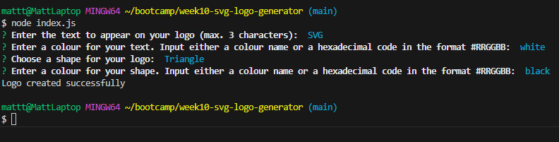

# week10-svg-logo-generator

## Table of Contents

[Description](#descriptin)

[Installaion](#installation)

[Usage](#usage)

[Tests](#tests)

[Images](#images)

[URLs](#urls)

[License](#license)

[Author](#author)

## Description

The code in this repository generates a simple SVG logo consisting of a background shape and up to three letters in the foreground.

## Installation

To install, simply clone the repository. Once it is cloned, navigate to the local repository and run "npm install" in the terminal. Once all packages are up to date, the logo generator can be run with the command "node index.js" in the terminal. To run the tests instead, run the command "npm run test" in the terminal.

## Usage

To use the application, the user only needs to answer the questions that are displayed in the terminal. Once all of the questions are answered, a logo will be automatically generated for the user. When the logo file is opened in a web browser, it will display the logo.

If the user wishes to change the logo, then they can run the application again and answer the questions differently, according to the changes they want to make.

## Tests

Three unit tests were written to test the rendering of each of the three shapes that can be used for the logos. These tests are found within the tests subfolder along with an image to show that they were all passed.

## Images

Image of the command line application after it has been run.

All unit tests were passed.

Image of the sample logo generated using this application.

## URLs

Walkthrough Video: https://drive.google.com/file/d/1liy_aPLPasKNWBvQ6fbzFNphuzkk0psI/view

My GitHub URL: https://github.com/Shippo704

GitHub Repository: https://github.com/Shippo704/week10-svg-logo-generator

## License

MIT License

## Author

Matthew Taylor (Shippo704)